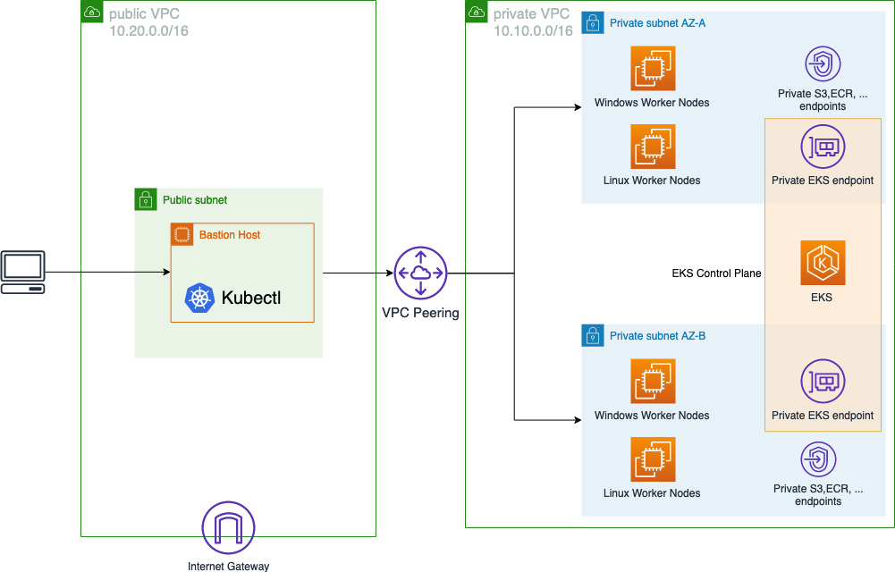

# Private EKS for Windows & Linux workloads with Terraform

* ✅ Provisions a private EKS cluster in a private VPC using Terraform, and deploys Windows and Linux nodes into the cluster. 
* ✅ Using VPC peering, a bastion host in a public VPC connects to the private VPC in order to access EKS cluster in the private VPC. The public VPC and bastion hosts are also part of this repository.Solution Architecture:




<details>
  <summary>Prerequisites: https://terraform.job4u.io/en/prerequisites/cloud9-bootstrap.html</summary>

  - [x] [AWS Account](https://docs.aws.amazon.com/cli/latest/userguide/cli-configure-files.html)
  - [x] `cloud9-tools-init.sh`: 
    - [x] [Terraform](https://www.terraform.io/downloads.html)
    - [x]  kubectl
    - [x]  k9s
  - [x] `init-state.sh`:
    - [x] S3 bucket to save the state.
    - [x] DynamoDB table for the statelock with partition key "LockID" of type String.
  - [ ] Create an EC2 SSH key in your AWS account if there is none existing by following this documentation: [Create a key pair using Amazon EC2](https://docs.aws.amazon.com/AWSEC2/latest/UserGuide/ec2-key-pairs.html#having-ec2-create-your-key-pair)
  
</details>


### Step 1. Initial for Terraform State

<details>
  <summary>workflows/1-tf-init-state.yml</summary>
  
  * [x] export PROJECT_ID=academy4u
  * [ ] [S3 Backend](https://www.terraform.io/language/settings/backends/s3): ${PROJECT_ID}-s3-state
  * [ ] DynamoDB: --table-name ${PROJECT_ID}-tf-lock --key-schema AttributeName=LockID >> Amazon DynamoDB table with partition key *LockID* of type String in your AWS account. 
  
</details>


### 2. Setting up the VPC Networking

> This performs the deployment of the VPC including the setup of the bastion host in a separate VPC.

<details>
  <summary>workflows/2-vpc-private.yml</summary>
  
  > Modify the `bucket` and `dynamodb_table` that are used by Terraform [modules/vpc-private-eks](./modules/vpc-private-eks/main.tf)

  ````
  terraform {vpc-private-eks
    backend "s3" {
      bucket         = "academy4u-s3-state"
      key            = "network.tfstate"
      region         = "ap-southeast-1"
      dynamodb_table = "academy4u-tf-lock"
    }
  }
  ````
  
</details>

<details>
  <summary>Open a command-line and move into the folder vpc-private-eks and execute the deployement with Terraform:</summary>
  
   ````bash
   |-- modules 
   |   |-- vpc-private-eks
   |   |   |-- main.tf
   |   |   |-- main-input.tfvars
   ````

   ```
   $ cd vpc-private-eks
   $ terraform init
   $ terraform apply -var-file main-input.tfvars
   ```  
  
</details>

> ✍️ Note down the output of `out_bastion_public_ip`


### 3. EKS Cluster setup